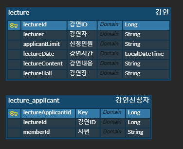
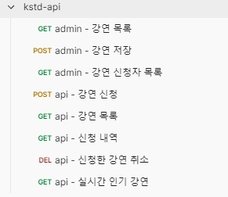

## 키다리스튜디오 백엔드 개발자 기술 과제

--- 

### 정보
* 개발 언어: Kotlin 1.9
* 프레임워크: Spring 6
* RDBMS: H2
* 데이터 설계:  
  
* 그 외:
  * 멀티 모듈과 헥사고날 아키텍쳐로 구성했습니다.
  * DB Audit Column은 생략했습니다.
  * 강연 신청 시 동시성 이슈를 고려해 Lock을 사용했습니다.  
    Production 이라면 Redis 분산 Lock 을 고려하겠지만, Local 환경이다보니 흉내만 냈습니다.
  * 테스트 코드는 유의미한 기능만 작성했습니다.
    * <a href="https://github.com/kis6905/kstd-test/blob/main/kstd-domain/src/test/kotlin/com/kstd/domain/lecture/service/LectureServiceTest.kt" target="_blank">LectureServiceTest.kt</a>

---

### Local 실행
* git clone
* IntelliJ 에서 열기
* gradle build
* kstd-interface > src > main > kotlin > KstdApplication.kt > main() 실행
  * VM Option  
    ```dtd
    -Dspring.profiles.active=local
    ```

---

### API Test (with Postman)
* Download - <a href="https://github.com/kis6905/kstd-test/blob/main/docs/kstd-api.postman_collection.json" target="_blank">Link</a>
* Postman 에서 Import  
  
